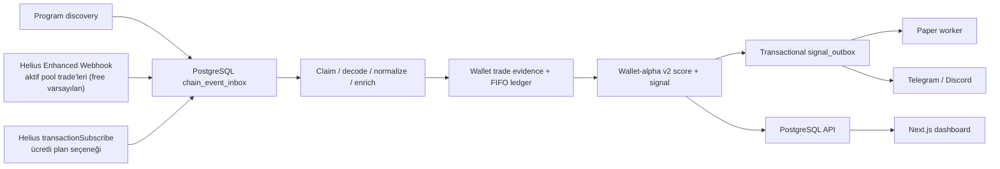

# Walletscaner v2

Solana'da yeni memetoken havuzlarını izleyen, doğrulanmış cüzdan trade'lerinden FIFO ledger üreten ve bir cüzdanın hem kârlılığını hem de bot tarafından takip edilebilirliğini ölçen araştırma ve paper-trading sistemi.

Bu proje canlı alım-satım botu değildir. `ENABLE_LIVE_EXECUTION=false` production Compose içinde sabittir; private key veya canlı emir yürütme kodu yoktur. Memetoken işlemleri çok yüksek kayıp, rug ve likidite riski taşır.

## Uygulanan v2 mimarisi



- PostgreSQL canonical system of record'dur. Redis yalnızca hot state/rate-limit sınıfı işler içindir; canonical teslimat garantisi Redis'e bağlı değildir.
- DexScreener canlı havuz kararları 30 saniyeye kadar sık ölçülebilir; bu bağlam ingestion içinde
  inline provenance ve kompakt güncel havuz durumu olarak kullanılır. Kalıcı `price_observations`
  yazıcısı yalnız evidence sampler'dır ve varsayılan 120 saniyelik kompakt kovalar kullanır.
- Her chain olayı işlenmeden önce metadata/idempotency durumu `chain_event_inbox` içine, tam provider
  JSON'u ise aynı transaction içindeki günlük `chain_event_payloads` partition'ına yazılır. Claim
  işlemleri lease, retry, processing-attempt ve dead-letter durumlarını saklar.
- Standard Solana log/RPC kaynağı program discovery ve sınırlı gap repair için korunur. Free Helius planında aktif pool işlemleri auth doğrulamalı Enhanced Webhook ile aynı inbox'a yazılır. `transactionSubscribe` yalnızca bu özelliği içeren ücretli planlarda seçilebilir.
- Worker incelenen program ID'lerini tek Helius webhook ile senkronlar. Böylece yeni pool'lar ayrıca webhook'a eklenmeden kapsanır, adres kümesi değişmedikçe ücretli yönetim isteği gönderilmez ve per-pool RPC backfill fırtınası oluşmaz.
- Trader seçimi signer/fee-payer veya venue decoder'ın doğruladığı authority ile sınırlandırılır; pool/vault/program altyapı adresleri trader kabul edilmez.
- Token miktarlarının canonical gösterimi `rawAmount: string` ve `decimals` alanlarıdır. Execution fiyatı aynı swap'taki quote miktarından; SOL quote için işlem zamanındaki Pyth SOL/USD fiyatından türetilir.
- FIFO ledger kısmi satışlarda realized PnL üretir, kalan miktarı açık inventory olarak tutar ve yeni round-trip'leri ayrı episode yapar.
- Wallet-alpha v2; realized profitability, followability ve reliability/risk sonuçlarını ayrı ölçer. 30/90 günlük pencereler, recency decay, Wilson lower bound ve sample-size shrinkage uygular.
- Yeni wallet-alpha sinyali, aynı DB transaction'ında `paper` ve `alert` outbox kayıtlarını oluşturur. Tüketiciler `FOR UPDATE SKIP LOCKED` ile çalışır.

Detaylar: [mimari](docs/architecture.md), [veri modeli](docs/data_model.md), [wallet intelligence](docs/wallet_intelligence.md), [operasyon](docs/operations.md) ve [provider notları](docs/providers.md).

## Kapsam

Uygulanan Solana discovery tanımları:

- Pump.fun create/migrate
- PumpSwap create-pool
- Raydium LaunchLab initialize/migrate
- Raydium CPMM initialize

Raydium manifest'i resmi IDL commit'i `e7e0c96fe77bcf6a020b84a44c47a722aac8e359` üzerine sabitlenmiştir. Free-plan varsayılanı `HELIUS_INGEST_MODE=rpc` hibritidir: geniş program keşfi için public RPC/WebSocket, küçük ve uygun havuz kümesi için Helius standard WebSocket, batched DexScreener fiyatı ve filtreli Helius HTTP/DAS fallback'i. Enhanced Webhook bilinçli ve bütçeli bir alternatif; `transaction-subscribe` ücretli plan seçeneğidir. EVM ve canlı execution kapsam dışıdır; Orca/Meteora adapter'ları ile gerçek mainnet venue fixture matrisi production rollout açığı olarak izlenir. Eski `live-alpha` / `market-watch` dosya-state yolu yalnızca offline araştırma için korunur ve server Compose'da `legacy-research` profili altındadır.

## Hızlı başlangıç

Gereksinimler: Node.js 22+, Docker ve Docker Compose.

```bash
cp .env.example .env
npm install
docker compose up -d postgres redis
npm run db:migrate
npm test
npm run typecheck
npm run lint
```

`research:wallet-alpha-managed-shadow` is a bounded, read-only managed-followability model-selection
tool over canonical `evidence-v1`. It writes no scores, signals or outbox rows; the default is 25
wallets and the hard ceiling is 100. Its output cannot feed Telegram or paper entry before the
future-only shadow and fill-realism gates pass.

Servisleri ayrı terminallerde çalıştırın:

```bash
npm run worker:solana
npm run worker:evidence-sampler
npm run research:wallet-alpha
npm run worker:paper-alert
npm run worker:telegram-notifier
npm run dev
```

Ardından API `http://localhost:4010`, dashboard `http://localhost:3010` adresindedir.

Production benzeri, hedefli çekirdek stack:

```bash
docker compose -p walletscaner -f docker-compose.server.yml --env-file .env.server config --quiet
docker compose -p walletscaner -f docker-compose.server.yml --env-file .env.server up -d --no-build postgres redis
docker compose -p walletscaner -f docker-compose.server.yml --env-file .env.server run --rm --no-deps migrate
docker compose -p walletscaner -f docker-compose.server.yml --env-file .env.server up -d --no-build --no-deps solana-ingestion
docker compose -p walletscaner -f docker-compose.server.yml --env-file .env.server ps
```

Sunucuda image build etmeyin; doğrulanmış prebuilt image yükleyin. `ui`, `research`, `paper`,
`notifications`, `operations` ve `legacy-research` profilleri paylaşımlı hostta açıkça onaylanmadan
etkinleştirilmez.

Production API `REPOSITORY_MODE=postgres` ile başlar ve DB hazır değilse açılmaz. Seed edilmiş memory repository yalnızca `NODE_ENV=test` veya `NODE_ENV=demo` içindir.

## Temel komutlar

```bash
npm run worker:solana
npm run worker:evidence-sampler
npm run worker:paper-alert
npm run worker:telegram-notifier
npm run backfill:dexscreener
npm run backfill:helius-history
npm run research:wallet-alpha
npm run research:wallet-alpha-managed-shadow
npm run research:evidence-report
npm run worker:replay
npm test
npm run typecheck
npm run lint
```

`research:market-watch` ve `research:live-alpha` production writer değildir; offline/legacy araştırma araçlarıdır.

## Wallet-alpha durum kapıları

- `observed`: en az 3 realized episode veya 3 mature followability sonucu.
- `watch`: en az 8/8 örnek, 4 aktif gün, pozitif dayanıklı merkez sonuçları ve PF en az 1.1.
- `candidate`: en az 15/15 örnek, 7 gün, en az %90 execution/oracle kalite coverage, PF en az 1.2, hit rate en az %55, winner contribution en fazla %40 ve followable worst return en az -%35.
- `validated-paper`: en az 30/30 örnek, 14 gün ve profitability/followability serilerinde iki ayrı kronolojik 10 örnek holdout geçişi.

Bilinmeyen veya başarısız kritik token-risk kanıtı paper sinyalini engeller. Doğrudan creator cüzdanları score seviyesinde `excluded` olur. Funder ve cluster/insider bağlantılarının eksiksiz production gate'e bağlanması hâlâ rollout işidir.

### $100 qualified-pool paper portföyü

`qualified-pool-paper-v1`, Telegram'a gelen nitelikli havuz bildirimlerini wallet-alpha sinyali gibi
etiketlemeden ayrı bir gelecek-zaman paper kohortunda işler. İlk girişten önce tam pool iki dakika
sonra yeniden doğrulanır. Portföy $100 ile başlar; pozisyon başına üst sınır $12, toplam açık risk
$36 ve eşzamanlı pozisyon sayısı üçtür. Strateji -%22 stop, likidite acil çıkışı, +%75'te ana para
geri alma, +%200 ikinci kâr alma, peak'ten %28 trailing stop ve 120 dakika zaman çıkışı uygular.
Gerçekten kaybolan/sıfır likiditeli pool için hayali stop fill'i yazılmaz; kalan değer sıfır kabul
edilir. Bütün paper olayları PostgreSQL'e tekil olarak kaydedilir ve mevcut Telegram notifier
üzerinden bildirilir. Canlı emir ve özel anahtar yoktur.

`qualified-pool-paper-v2`, v1 sonucunu silmeden ayrı ve yalnızca gelecekteki bildirimleri kullanan
yeni $100 kohortudur. Beş dakikalık exact-pool doğrulaması, en az $30k likidite, $10k/5dk hacim,
%58 alış payı ve sınırlı turnover ister; aynı anda en fazla iki $8 pozisyon açar. V1 negatif kontrol
olarak değişmeden saklanır. V2'ye geçiş `PAPER_STRATEGY_VERSION` ile açıkça yapılır ve eski işlemler
yeni portföye taşınmaz.

## API

- `GET /health`
- `GET /api/pipeline/health`
- `GET /api/wallet-alpha/rankings`
- `GET /api/wallets/:address/alpha`
- `GET /api/wallet-alpha/signals`
- `GET /api/recent-tokens`
- `GET /api/tokens/:chain/:address`
- `GET /api/tokens/:chain/:address/risk`
- `GET /api/wallets/:address`
- `GET /api/wallet-rankings`
- `GET /api/signals`
- `GET /api/paper-trades`
- `GET /api/backtests`
- `GET /api/provider-status`
- `GET /api/config`
- `POST /api/webhooks/helius`

Liste endpoint'leri `{ "data": ... }` envelope'u döndürür. Wallet-alpha endpoint'leri `strategyVersion`, `status`, `limit` ve `offset` query parametrelerini destekler.

## Güvenlik ve veri kalitesi

- Secret'lar yalnızca `.env`, container secret veya secret manager'da tutulmalıdır.
- Webhook için `HELIUS_WEBHOOK_AUTH_HEADER` zorunlu olarak yapılandırılmalıdır.
- `observed-execution` ve `oracle-converted` yüksek kaliteli fiyat sayılır; `market-proxy` ve `historical-estimate` candidate coverage hesabında yüksek kalite değildir.
- DEX Screener execution fiyatı değildir; likidite/market context ve paper exit ölçümü için kullanılır.
- Pool yaşı worker receive time'dan değil chain `blockTime` değerinden hesaplanır.
- Duplicate event ve signal teslimatları DB unique key'leriyle idempotenttir.

## Rollout durumu

Kod yolu hazır olsa da production doğruluğu yalnız testlerin geçmesiyle ilan edilmez. Aşağıdakiler canlı ortamda henüz kanıtlanması gereken kabul kapılarıdır:

- gerçek mainnet fixture setinde desteklenen instruction parse coverage en az %99;
- ingest lag p95 `< 3s`, p99 `< 10s`;
- reconnect gap'lerinin tamamının 5 dakika içinde kapanması;
- candidate wallet'larda yüksek kaliteli execution coverage en az %90;
- duplicate replay sonrası ledger/skor hash'lerinin değişmemesi;
- yedi günlük shadow run'da büyümeyen backlog ve sınırsız artmayan bellek;
- alert latency p95 `< 10s` ve aynı sinyalin tek teslimatı;
- finalized reconciliation ve rollback işaretleme doğrulaması.

Alert kanallarını canlı kullanıcıya açmadan önce yedi günlük shadow ingest ve en az 14 günlük paper-only ölçüm tamamlanmalıdır. Uygulama incelemesi ve doğrulama checklist'i `reports/walletscaner-v2-implementation-review.html` dosyasındadır.
