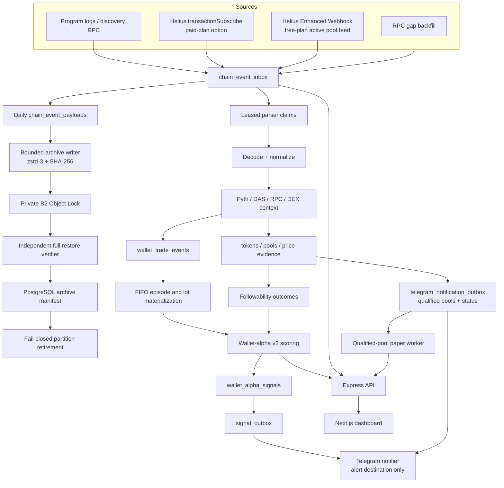

# Architecture

Walletscaner v2 is an evidence pipeline. PostgreSQL, not a report file or an in-memory cache, is the canonical boundary between every stage that can lose or duplicate work.



## Canonical event flow

1. Discovery and trade sources atomically write canonical metadata to `chain_event_inbox` and the
   complete provider JSON to a daily `chain_event_payloads` partition before parser side effects.
2. The primary key is an idempotency key. Duplicate source delivery resolves to the existing row.
3. Parser workers claim ordered work with a lease. Each claim creates an `event_processing_attempts` row.
4. Successful work records `processed_at`; failures move to `retry` with a future eligibility time or to `dead_letter` after the attempt ceiling.
5. `pipeline_watermarks` records parser progress and health metadata.

Cold storage does not weaken this boundary. Each settled daily payload partition is exported from a
repeatable-read snapshot into a versioned JSONL/zstd object. PostgreSQL owns the revisioned manifest;
an independent credential must fully download and restore/hash the object, while the manifest must
carry either provider-read Object Lock retention or the explicitly weaker attested bucket-default
policy before maintenance may retire the source partition. A second PostgreSQL-owned policy records the
archive rollout activation and can be approved only by a non-empty verified UTC day wholly after
that activation. Maintenance additionally requires an explicit runtime retirement flag. Missing
policy approval, lock evidence, partial uploads, stale revisions and checksum differences keep the
PostgreSQL source intact.

The recurring writer anti-joins existing manifest windows before applying its bounded daily seed
limit. Therefore completed early partitions cannot permanently hide later days. Writer and verifier
run serially per scheduler instance with durable leases, retries, dead-letter state and no overlap.

The inbox separates four clocks:

- `occurred_at`: chain `blockTime`, used for pool age and ledger ordering;
- `received_at`: first durable receipt by this system;
- `processed_at`: successful parser completion;
- `finalized_at`: reserved for finalized reconciliation.

Confirmed events are sufficient for shadow and paper measurement. The schema supports `finalized` and `rolled_back`, but production finalized reconciliation/rollback handling remains a rollout requirement.

## Solana source split

The active worker uses two source roles and one selectable trade-ingest mode:

- Each configured launch program owns an independent `StandardSolanaEventSource`, supervisor state
  and restart boundary. One failed or slow program therefore cannot stop healthy discovery sources.
  Each source performs bounded signature/RPC gap repair; an unresolved older transaction or block
  time stops cursor advancement for that address.
- Because standard `logsSubscribe` cannot filter instruction names at the provider, a discovery
  source whose every address has an exact log filter rejects raw nonmatching notification strings
  before JSON parsing. Adding any unfiltered address disables this optimization fail-safe.
- `HELIUS_INGEST_MODE=rpc` is the active fixed-cost profile. Public RPC performs reviewed program
  discovery while Helius standard `logsSubscribe` follows at most three pools that pass the cheap
  market observation gate. Observation admission is deliberately separate from alpha admission:
  the accepted one-vCPU shared-host override is one active pool because its measured parser
  throughput drains while three active pools do not.
  known/passed critical risk, controlled flow and complete coverage remain downstream requirements.
  A pool is held for at least five minutes before an unprotected observation can rotate; an
  alpha-protected subscription is never evicted for an exploratory candidate. Every rotation,
  expiry or rug is durably persisted as an incomplete-coverage boundary before unsubscribe.
  If its bounded HTTP-resolution queue reaches the high-water mark, the hot pool is immediately
  unsubscribed and persisted as incomplete trade coverage; it cannot contaminate alpha scoring.
- `HELIUS_INGEST_MODE=webhook` is an optional authenticated Enhanced Webhook profile. It requires an
  explicit provider-budget decision and is not silently enabled.
- `HELIUS_INGEST_MODE=transaction-subscribe` enables `HeliusTransactionEventSource` only for a Helius plan that exposes that method. A free-plan rejection is surfaced in diagnostics and disables its backfill queue instead of flooding RPC history.

Live and backfill delivery is serialized per watched address. A fetched event is acknowledged and
its source cursor advances only after the canonical handler has accepted it durably. A temporary
storage-admission rejection retains that exact fetched event in memory and retries it at a bounded
cadence; it is not silently skipped and is not fetched repeatedly. Standard and Helius sockets use
connection generations so delayed acknowledgements, messages, errors or pongs from an obsolete
socket cannot mutate the new connection.

Backfill makes a one-row boundary probe after its bounded page budget. If more history remains, the
source records truncation, leaves the cursor behind the unknown range and the per-program supervisor
opens a fail-closed coverage incident. Cursor evidence includes the last durably admitted event's
chain `occurred_at`; parser completion time is never used as the beginning of a possible chain gap.
A source with no prior cursor starts at an explicit activation boundary and samples only its bounded
recent page. That bootstrap is not evidence of pre-activation historical completeness.

The supervisor probes `getSignaturesForAddress(limit=1)` only after a health breach and no more than
once per configured cooldown. A JSON-RPC error or malformed result is an error, not proof that the
program was quiet. A newer slot, or a different latest signature in the same slot, is conservative
evidence that the WebSocket may have missed activity. Recovery requires a successful restart plus
fresh post-restart WebSocket evidence. Transport-only recovery remains
`transport_recovered_gap_unreconciled`. Standard discovery sources additionally stage a durable,
bounded signature repair, find the old cursor boundary before replay, replay oldest-first, and
bind completion to the immutable newest signature captured when repair collection began. A
separate `getSignatureStatuses(searchTransactionHistory=true)` call must return that exact slot
with `finalized` status; the mutable live cursor and advancing latest program head are never
repair proof. Transaction success is not a boundary requirement: a finalized failed transaction
is an immutable ordered signature and replay classifies it as producing no discovery event. The
proof metadata retains whether that target transaction succeeded. Only exact slot/finality, full
replay and post-incident WebSocket evidence set `coverage_reconciled_at`; incomplete, capped or
unresolved repair remains fail-closed.

The old bounded “top wallets become new subscriptions” loop is not part of the v2 production path. Wallet evidence is derived from transactions involving active pools, avoiding circular discovery based on wallets the scorer already knows.

`HeliusEnhancedTransactionBatcher` is available for discovery signature batches up to 100. Historical/backfill code remains independent of the live full-transaction stream.

## Decode and enrichment boundary

- Pool creation/migration definitions are configured by reviewed program ID and instruction discriminator.
- Discovery scans top-level and CPI/inner instructions, resolves versioned loaded-address indices,
  stores the selected instruction coordinates and isolates malformed instruction data. The
  `walletscaner-v3-inner-cpi` tag makes future evidence distinguishable from earlier decoder output.
- Standard-RPC WebSocket notifications and fetched initial/reconnect backfill transactions apply
  the same exact instruction-log predicate. Resolved non-matching backfill transactions advance the
  source cursor but are neither emitted nor persisted, so decoder coverage measures candidate
  instructions rather than arbitrary program traffic.
- Raydium LaunchLab/CPMM definitions are pinned to one official IDL commit.
- Wallet balance decoding only accepts transaction signers/fee payer or an explicitly verified venue authority. Known pool/program infrastructure is excluded.
- Live wallet trades persist both buys and sells in `wallet_trade_events`. The separate `swaps`
  bridge stores only buys needed for first-entry linkage and has a three-day hot retention horizon;
  it is not a second permanent trade ledger.
- Exact token quantities are carried as base-10 integer strings plus decimals. Display `number` fields are compatibility-only.
- Stablecoin quote legs are treated as observed USD execution. SOL quote legs use a live or historical Pyth SOL/USD observation nearest chain time.
- DEX Screener supplies liquidity and market context, not canonical execution price.
- Live pool decisions may sample market context faster than the durable research cadence.
  `solana-ingestion` uses that value inline for price provenance, wallet-entry decisions and a
  compact current `pools` row; it does not append to `price_observations`. The current pool row is
  refreshed at most every five minutes while market eligibility is unchanged, but the first sample,
  every eligibility transition and every detected rug persist immediately. The evidence sampler is
  the sole durable price-history writer and uses deterministic pool/120-second compact buckets.
- Provider reads remain token-batched, while active entries are grouped by `(token, exact pool)` so
  one mint's first pool cannot starve another pool of followability evidence. Calculated outcomes
  are filtered to monotonic lifecycle transitions and persisted in bounded multi-row writes; wallet
  queue invalidation is coalesced once per changed wallet and batch.
- Wallet outcomes are lifecycle-driven rather than poll-driven. The first provisional snapshot is
  durable; repeated calculations in the same state are no-ops. PostgreSQL writes the row again only
  when it advances to `unresolved` or `mature`, and mature evidence is immutable. This prevents the
  sampler from repeatedly rewriting outcome indexes or enqueuing unchanged wallet-alpha revisions.
- Token risk combines Helius DAS metadata and Solana RPC supply/largest-account evidence. Missing
  or failed critical evidence closes pool trade admission before wallet-entry and outcome
  materialization, not merely at final signal generation.

## Telegram notification boundary

Telegram delivery remains independent from paper decisions. The dedicated notifier is the only
Telegram API consumer. It claims the `alert` destination from `signal_outbox` and the durable
`telegram_notification_outbox`, including qualified-pool, paper-trade and status messages. Pool
discovery messages are not wallet-alpha signals. A recent pool enters the outbox only after
canonical pool state has at least the configured liquidity and five-minute volume and the latest
token-risk record is known and warning-free. The versioned `strict-flow-v2-20260817` path also
requires five-minute maturity, bounded transaction/buy-share/turnover evidence, top-10 holder
concentration below 20% and complete trade coverage. Its payload freezes every admission feature;
`riskConfidence` is evidence coverage, not predicted profit probability. Quote/system mints are
explicitly excluded.

Strict-pool selection and claim-time validation join the payload back to the canonical Solana token
and exact pool address. A pool whose chain creation time falls inside an open or closed-but-
unreconciled discovery incident for its program is ineligible. Already queued candidates that later
become tainted move to the terminal, retained `suppressed` state; they are not delivered or deleted.

`telegram_notification_outbox` uses unique event/source keys, leases, retries and dead-letter state.
`telegram_notification_state` persists the first-start watermark so restarts neither flood old pools
nor miss post-activation candidates. Status summaries use deterministic time buckets. Telegram is an
at-least-once external API; a crash after Telegram accepts a message but before the DB completion
write can still cause a rare duplicate, which must remain visible rather than silently losing work.

Each qualified-pool paper strategy starts from its own activation timestamp and never backfills
pre-activation notifications as fills. `qualified-pool-paper-v1` is retained as an immutable
negative control. The separately selectable `qualified-pool-paper-v2` waits five minutes, fetches
the exact notified pool, repeats a fresh fail-closed risk check and requires stronger retained
liquidity, volume, transaction, buy-share and turnover evidence before opening a smaller position.
The separately versioned `qualified-pool-paper-v3-strict-flow` consumes only strict-v2 payloads
after its own activation and repeats exact-pool flow, liquidity-retention and realistic-cost checks.
Every simulated buy, partial exit, close and terminal rug outcome is an append-only
`paper_trade_event`; the current position is materialized in `paper_trades`. Telegram paper messages
are enqueued transactionally after the paper event and are delivered by the existing notifier.
Paper candidate selection and the delayed entry recheck apply the same canonical exact-pool incident
test. The final paper-open transaction acquires the same per-program PostgreSQL advisory lock used
to open an incident and rechecks coverage before inserting the trade. This serializes a known or
concurrently committing incident with the simulated entry; it cannot foresee an incident discovered
later whose conservative gap boundary reaches backward across an already recorded paper fill. Such
paper evidence remains append-only but is coverage-tainted and must be excluded from strategy
evaluation rather than presented as an executable alpha result.

Raydium venue-specific instruction matching is implemented as a provider module; full use of that match context for every runtime trade variant and the equivalent Pump sell decoder still require fixture-backed rollout verification.

## Wallet-alpha and signal flow

`wallet_trade_events` feed a deterministic FIFO ledger:

- each partial sell realizes the matching oldest lot cost;
- remaining units stay in open inventory;
- inventory returning to zero closes a round-trip, and the next buy starts a new episode;
- input order and duplicate delivery do not change the computed result.

The scorer independently summarizes realized profitability and source-linked followability over 30/90-day windows. Reliability uses sample-size shrinkage, Wilson lower bounds, sample diversity, concentration, drawdown and recency decay. Direct creators are excluded; unknown/failed token risk blocks downstream paper signals.

The production scorer leases one wallet revision at a time. Before claiming, it may prefetch at
most 100 queue candidates without locking them; bounded lateral index probes read no more than six
trades and three entries per wallet under a five-second statement timeout. Prefetch results are
valid only for the exact observed queue revision, so a concurrent evidence write forces a fresh
one-wallet probe after claim. Revisions below both evidence floors are completed without a score,
while their durable evidence is retained and later evidence requeues them. This keeps one-off
traders out of the expensive scoring path without embedding evidence predicates in the ordered
claim SQL or leasing a batch of wallets. Admitted wallets then receive separate five-second,
index-backed upper-bound probes for trades, entries and outcomes. The three relations no longer
share one aggregate statement timeout, so normal I/O variance cannot repeatedly reject an otherwise
bounded wallet; a timeout is reported with its exact relation and remains retryable.

The queue has one revision-safe row per wallet and strategy, not duplicate hot/cold queues. Priority
`2` is restricted to a source-linked, controlled-flow entry with known and passed critical token
risk whose latest persisted wallet status is `watch`, `candidate` or `validated-paper`; risk-passed
entries from unqualified wallets remain priority `1`. Other score-changing entries, sells and
outcomes also use priority `1`; priority `0` covers buys, price enrichment and historical
materialization. A producer coalesces work by incrementing the revision and taking the greater
priority. Completion resets priority only when no newer revision arrived during the lease. Claims
always take the highest ready priority and remain FIFO within a lane. PostgreSQL `NOTIFY` wakes the
same bounded worker for elevated work, but the durable queue and 30/300-second fallback polls remain
the recovery truth if a notification or listener is lost.

Live price enrichment passes the worker's configured trade/entry admission floors and source window
into persistence. PostgreSQL always stores the changed price evidence, then increments score work
only when the wallet has reached either bounded floor. Trade and entry writes remain unconditional
transactional producers; this preserves threshold crossings and concurrent smart-wallet discovery
while suppressing the dominant redundant enrichment revisions. It does not filter canonical
evidence, change lane priority or weaken score/risk gates.

The optional `wallet-alpha-managed-v2` research path reuses the same canonical entries, trades and
frozen outcomes, selects the managed `tp15-sl20-20m` followability series, and compares it with the
fixed-horizon source score in a bounded read-only report. It does not claim the wallet-alpha work
queue, persist score rows, create outbox work or contact Telegram. This isolation is intentional
until fill realism and chronological shadow gates pass. The report processes at most ten wallets per
evidence batch, excludes entries whose durable buy-to-observation delay is missing or exceeds the
configured bound, and outcome construction accepts only observations for the entry's exact pool.

## Future exact-pool decision tape

Migration 052 adds an isolated, future-only research lane. It does not alter the canonical ingest,
wallet-alpha, signal outbox, paper or Telegram paths:

```text
future eligible exact pool -> immutable decision snapshot -> six leased checkpoints
  -> exact-pair market state + normalized Jupiter buy/sell quote surface
  -> retained research evidence only
```

Admission is oldest-first, at most 25 candidates per seed pass and 100 decisions per UTC day. A
research-eligible decision receives exactly six checkpoints at 0/15/30/60/120/300 seconds. Claims
use `SKIP LOCKED`, at most two rows, a lease and six-attempt terminal dead-letter budget. Each
checkpoint writes its bounded market/flow fields and no more than six quote rows atomically. The
collector uses at most two PostgreSQL connections and makes quote calls serially; its isolated
`alpha-research` Compose profile is capped at 0.03 CPU and 80 MiB.

Risk, finalized/gap-free coverage, creator evidence, identity independence and executable route
quality remain separate. Missing cluster/funder/bundle evidence is recorded as `unknown`; it is not
inferred from address counts. `paper_eligible` is constrained false, no outbox row is created and
`ENABLE_LIVE_EXECUTION=false` remains unchanged. The fixed 60-day scalar lifecycle is intentionally
small and does not create another raw-provider archive.

Saving a new `wallet_alpha_signal` transactionally creates `paper` and `alert` messages. Consumers use `FOR UPDATE SKIP LOCKED`, leases, retries and dead-letter states. This permits independent paper and notification delivery without double-sending one outbox message.

## Service ownership

- `apps/worker/src/watch-solana.ts`: source lifecycle, durable enqueue, canonical parse, risk/price enrichment and live evidence writes.
- `scripts/research/wallet-alpha-worker.ts`: bounded incremental FIFO scoring and signal refresh.
- `scripts/research/wallet-alpha.ts`: on-demand full coverage/report summary; not a scheduled service.
- `apps/worker/src/process-wallet-alpha-outbox.ts`: qualified-pool paper entry/position decisions
  and durable notification enqueue.
- `apps/worker/src/collect-alpha-decision-tape.ts`: disabled-by-default future exact-pool research
  checkpoints; it has no delivery or execution ownership.
- `apps/api`: PostgreSQL-backed read API plus authenticated Helius webhook receiver.
- `apps/web`: dashboard for tokens, wallet-alpha rankings/signals and pipeline health.
- `packages/providers`: external-system adapters and chain decoders.
- `packages/db`: memory test adapter plus PostgreSQL repositories/lease operations.
- `scripts/archive` and `packages/db/archive-*`: bounded export, independent restore verification,
  manifest leases/retries and archive-gated partition retirement.
- `packages/core`: deterministic evidence, ledger and scoring logic.

## Runtime boundaries

- PostgreSQL is required in production. The API calls `assertReady()` before listening.
- The memory repository is restricted to test/demo mode.
- Redis is deployed with AOF for hot state but is not the source of truth for inbox/outbox delivery.
- `market-watch` is isolated behind the `legacy-research` Compose profile and must not write the canonical production path.
- Live execution is disabled; paper decisions are the terminal execution boundary.
- Canonical insertion stores metadata plus the immutable payload SHA-256 in the inbox and the full
  JSON in a daily sidecar partition in one transaction. Once migration 033 and the archive profile
  are activated, a partition can be dropped only after its complete object has passed independent
  B2 Object Lock and full-restore verification. Old unresolved payloads move to a compact hold table
  in the same retirement transaction; pending, retrying and dead-letter work is never discarded.
  Canonical metadata remains for the three-day hot inbox horizon, and incomplete metadata coverage
  prevents archive verification.
- Price paths use two-day daily partitions. Wallet evidence is admitted only after market and token
  risk pass, rejected diagnostic evidence remains three days, and admitted trade/entry/outcome
  evidence remains 95 days for the 30/90-day scorer.
- `solana-ingestion` has a filesystem admission circuit breaker: it stops both sources and parser
  writes at the critical disk boundary and resumes only after the lower hysteresis threshold and
  minimum-free-space gate are both satisfied. Cursor-backed gap repair remains mandatory on resume.
- Superseded wallet-alpha score snapshots remain for seven days while the latest row per
  wallet/strategy is always preserved. This keeps the acceptance shadow inspectable without turning
  five-minute derived revisions into a second unbounded evidence store.

The current raw-payload archive solves only the first fixed-disk tier. The 95-day canonical wallet
evidence set has not yet reached equilibrium and cannot be assumed to fit. The measured target is a
separate, independently restored daily wallet-evidence archive plus compact incremental FIFO and
followability facts in PostgreSQL. Its populated-clone benchmark, invariants and rollout gates are
documented in [storage_lifecycle.md](storage_lifecycle.md). Until those gates pass, existing
canonical evidence remains authoritative and must not be retired.

## Production acceptance boundary

The architecture is implemented in code, but the system is not production-validated until the mainnet fixture matrix, reconnect chaos replay, seven-day shadow run, 14-day paper-only run and documented latency/coverage thresholds have passed. See [operations.md](operations.md) for those gates.
