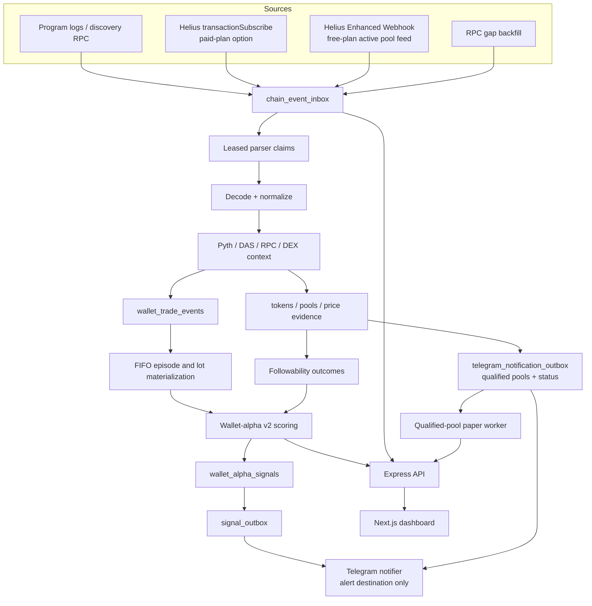

# Architecture

Walletscaner v2 is an evidence pipeline. PostgreSQL, not a report file or an in-memory cache, is the canonical boundary between every stage that can lose or duplicate work.

## Canonical event flow

1. Discovery and trade sources atomically write canonical metadata to `chain_event_inbox` and the
   complete provider JSON to a daily `chain_event_payloads` partition before parser side effects.
2. The primary key is an idempotency key. Duplicate source delivery resolves to the existing row.
3. Parser workers claim ordered work with a lease. Each claim creates an `event_processing_attempts` row.
4. Successful work records `processed_at`; failures move to `retry` with a future eligibility time or to `dead_letter` after the attempt ceiling.
5. `pipeline_watermarks` records parser progress and health metadata.

The inbox separates four clocks:

- `occurred_at`: chain `blockTime`, used for pool age and ledger ordering;
- `received_at`: first durable receipt by this system;
- `processed_at`: successful parser completion;
- `finalized_at`: reserved for finalized reconciliation.

Confirmed events are sufficient for shadow and paper measurement. The schema supports `finalized` and `rolled_back`, but production finalized reconciliation/rollback handling remains a rollout requirement.

## Solana source split

The active worker uses two source roles and one selectable trade-ingest mode:

- `StandardSolanaEventSource` always watches the configured launch programs and performs bounded signature/RPC gap repair. An unresolved older transaction or block time stops cursor advancement for that address.
- `HELIUS_INGEST_MODE=rpc` is the active fixed-cost profile. Public RPC performs reviewed program
  discovery while Helius standard `logsSubscribe` follows at most three market/risk-admitted pools.
  If its bounded HTTP-resolution queue reaches the high-water mark, the hot pool is immediately
  unsubscribed and persisted as incomplete trade coverage; it cannot contaminate alpha scoring.
- `HELIUS_INGEST_MODE=webhook` is an optional authenticated Enhanced Webhook profile. It requires an
  explicit provider-budget decision and is not silently enabled.
- `HELIUS_INGEST_MODE=transaction-subscribe` enables `HeliusTransactionEventSource` only for a Helius plan that exposes that method. A free-plan rejection is surfaced in diagnostics and disables its backfill queue instead of flooding RPC history.

The old bounded “top wallets become new subscriptions” loop is not part of the v2 production path. Wallet evidence is derived from transactions involving active pools, avoiding circular discovery based on wallets the scorer already knows.

`HeliusEnhancedTransactionBatcher` is available for discovery signature batches up to 100. Historical/backfill code remains independent of the live full-transaction stream.

## Decode and enrichment boundary

- Pool creation/migration definitions are configured by reviewed program ID and instruction discriminator.
- Raydium LaunchLab/CPMM definitions are pinned to one official IDL commit.
- Wallet balance decoding only accepts transaction signers/fee payer or an explicitly verified venue authority. Known pool/program infrastructure is excluded.
- Live wallet trades persist both buys and sells in `wallet_trade_events`. The separate `swaps`
  bridge stores only buys needed for first-entry linkage and has a three-day hot retention horizon;
  it is not a second permanent trade ledger.
- Exact token quantities are carried as base-10 integer strings plus decimals. Display `number` fields are compatibility-only.
- Stablecoin quote legs are treated as observed USD execution. SOL quote legs use a live or historical Pyth SOL/USD observation nearest chain time.
- DEX Screener supplies liquidity and market context, not canonical execution price.
- Live pool decisions may sample market context faster than the durable research cadence.
  `solana-ingestion` uses that value inline for price provenance, wallet-entry decisions and a
  compact current `pools` row; it does not append to `price_observations`. The current pool row is
  refreshed at most every five minutes while market eligibility is unchanged, but the first sample,
  every eligibility transition and every detected rug persist immediately. The evidence sampler is
  the sole durable price-history writer and uses deterministic pool/120-second compact buckets.
- Wallet outcomes are lifecycle-driven rather than poll-driven. The first provisional snapshot is
  durable; repeated calculations in the same state are no-ops. PostgreSQL writes the row again only
  when it advances to `unresolved` or `mature`, and mature evidence is immutable. This prevents the
  sampler from repeatedly rewriting outcome indexes or enqueuing unchanged wallet-alpha revisions.
- Token risk combines Helius DAS metadata and Solana RPC supply/largest-account evidence. Missing
  or failed critical evidence closes pool trade admission before wallet-entry and outcome
  materialization, not merely at final signal generation.

## Telegram notification boundary

Telegram delivery remains independent from paper decisions. The dedicated notifier is the only
Telegram API consumer. It claims the `alert` destination from `signal_outbox` and the durable
`telegram_notification_outbox`, including qualified-pool, paper-trade and status messages. Pool
discovery messages are not wallet-alpha signals. A recent pool enters the outbox only after
canonical pool state has at least the configured liquidity and five-minute volume and the latest
token-risk record is known and warning-free. Quote/system mints are explicitly excluded.

`telegram_notification_outbox` uses unique event/source keys, leases, retries and dead-letter state.
`telegram_notification_state` persists the first-start watermark so restarts neither flood old pools
nor miss post-activation candidates. Status summaries use deterministic time buckets. Telegram is an
at-least-once external API; a crash after Telegram accepts a message but before the DB completion
write can still cause a rare duplicate, which must remain visible rather than silently losing work.

Each qualified-pool paper strategy starts from its own activation timestamp and never backfills
pre-activation notifications as fills. `qualified-pool-paper-v1` is retained as an immutable
negative control. The separately selectable `qualified-pool-paper-v2` waits five minutes, fetches
the exact notified pool, repeats a fresh fail-closed risk check and requires stronger retained
liquidity, volume, transaction, buy-share and turnover evidence before opening a smaller position.
Every simulated buy, partial exit, close and terminal rug outcome is an append-only
`paper_trade_event`; the current position is materialized in `paper_trades`. Telegram paper messages
are enqueued transactionally after the paper event and are delivered by the existing notifier.

Raydium venue-specific instruction matching is implemented as a provider module; full use of that match context for every runtime trade variant and the equivalent Pump sell decoder still require fixture-backed rollout verification.

## Wallet-alpha and signal flow

`wallet_trade_events` feed a deterministic FIFO ledger:

- each partial sell realizes the matching oldest lot cost;
- remaining units stay in open inventory;
- inventory returning to zero closes a round-trip, and the next buy starts a new episode;
- input order and duplicate delivery do not change the computed result.

The scorer independently summarizes realized profitability and source-linked followability over 30/90-day windows. Reliability uses sample-size shrinkage, Wilson lower bounds, sample diversity, concentration, drawdown and recency decay. Direct creators are excluded; unknown/failed token risk blocks downstream paper signals.

The production scorer leases one wallet revision at a time. A bounded admission probe reads no more
than six trades and three entries before any full FIFO rebuild. Revisions below both evidence floors
are completed without a score, while their durable evidence is retained and later evidence requeues
them. This keeps one-off traders out of the expensive scoring path without making them disappear or
embedding correlated table probes in the ordered claim SQL.

The optional `wallet-alpha-managed-v2` research path reuses the same canonical entries, trades and
frozen outcomes, selects the managed `tp15-sl20-20m` followability series, and compares it with the
fixed-horizon source score in a bounded read-only report. It does not claim the wallet-alpha work
queue, persist score rows, create outbox work or contact Telegram. This isolation is intentional
until fill realism and chronological shadow gates pass.

Saving a new `wallet_alpha_signal` transactionally creates `paper` and `alert` messages. Consumers use `FOR UPDATE SKIP LOCKED`, leases, retries and dead-letter states. This permits independent paper and notification delivery without double-sending one outbox message.

## Service ownership

- `apps/worker/src/watch-solana.ts`: source lifecycle, durable enqueue, canonical parse, risk/price enrichment and live evidence writes.
- `scripts/research/wallet-alpha-worker.ts`: bounded incremental FIFO scoring and signal refresh.
- `scripts/research/wallet-alpha.ts`: on-demand full coverage/report summary; not a scheduled service.
- `apps/worker/src/process-wallet-alpha-outbox.ts`: qualified-pool paper entry/position decisions
  and durable notification enqueue.
- `apps/api`: PostgreSQL-backed read API plus authenticated Helius webhook receiver.
- `apps/web`: dashboard for tokens, wallet-alpha rankings/signals and pipeline health.
- `packages/providers`: external-system adapters and chain decoders.
- `packages/db`: memory test adapter plus PostgreSQL repositories/lease operations.
- `packages/core`: deterministic evidence, ledger and scoring logic.

## Runtime boundaries

- PostgreSQL is required in production. The API calls `assertReady()` before listening.
- The memory repository is restricted to test/demo mode.
- Redis is deployed with AOF for hot state but is not the source of truth for inbox/outbox delivery.
- `market-watch` is isolated behind the `legacy-research` Compose profile and must not write the canonical production path.
- Live execution is disabled; paper decisions are the terminal execution boundary.
- Canonical insertion stores metadata plus the immutable payload SHA-256 in the inbox and the full
  JSON in a daily sidecar partition in one transaction. Successfully processed payloads remain for
  48 hours. Old unresolved payloads move to a compact hold table before their daily high-volume
  partition is dropped; pending, retrying and dead-letter work is never discarded. Canonical
  metadata remains for the three-day hot inbox horizon.
- Price paths use two-day daily partitions. Wallet evidence is admitted only after market and token
  risk pass, rejected diagnostic evidence remains three days, and admitted trade/entry/outcome
  evidence remains 95 days for the 30/90-day scorer.
- `solana-ingestion` has a filesystem admission circuit breaker: it stops both sources and parser
  writes at the critical disk boundary and resumes only after the lower hysteresis threshold and
  minimum-free-space gate are both satisfied. Cursor-backed gap repair remains mandatory on resume.
- Superseded wallet-alpha score snapshots remain for seven days while the latest row per
  wallet/strategy is always preserved. This keeps the acceptance shadow inspectable without turning
  five-minute derived revisions into a second unbounded evidence store.

## Production acceptance boundary

The architecture is implemented in code, but the system is not production-validated until the mainnet fixture matrix, reconnect chaos replay, seven-day shadow run, 14-day paper-only run and documented latency/coverage thresholds have passed. See [operations.md](operations.md) for those gates.
